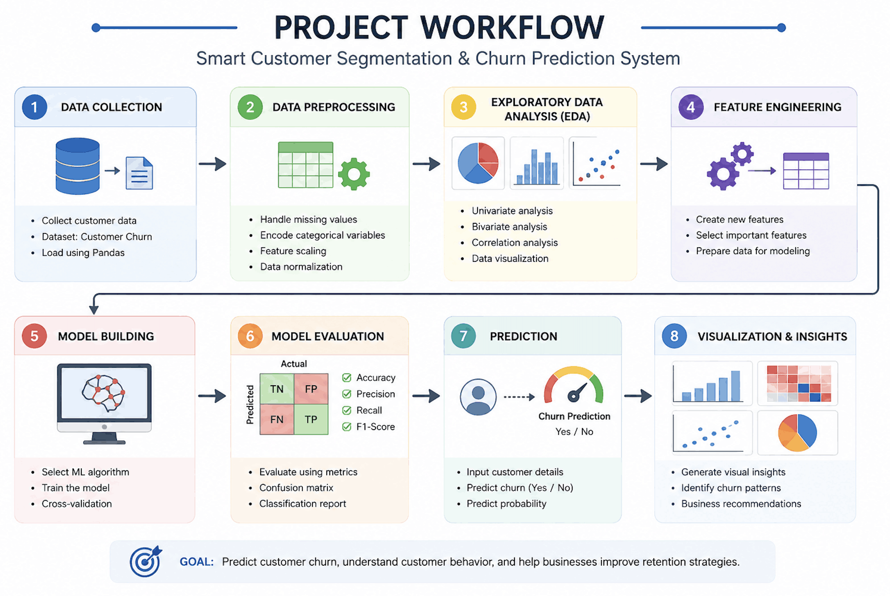
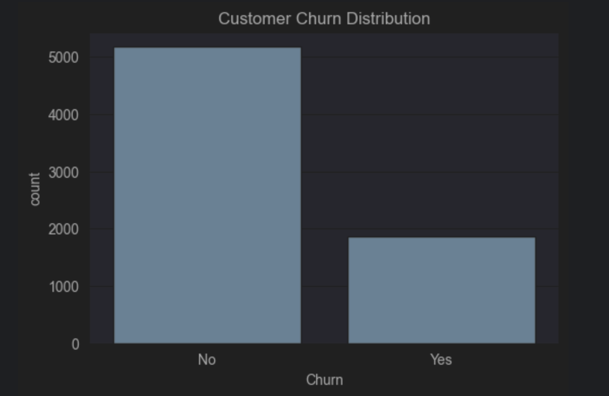
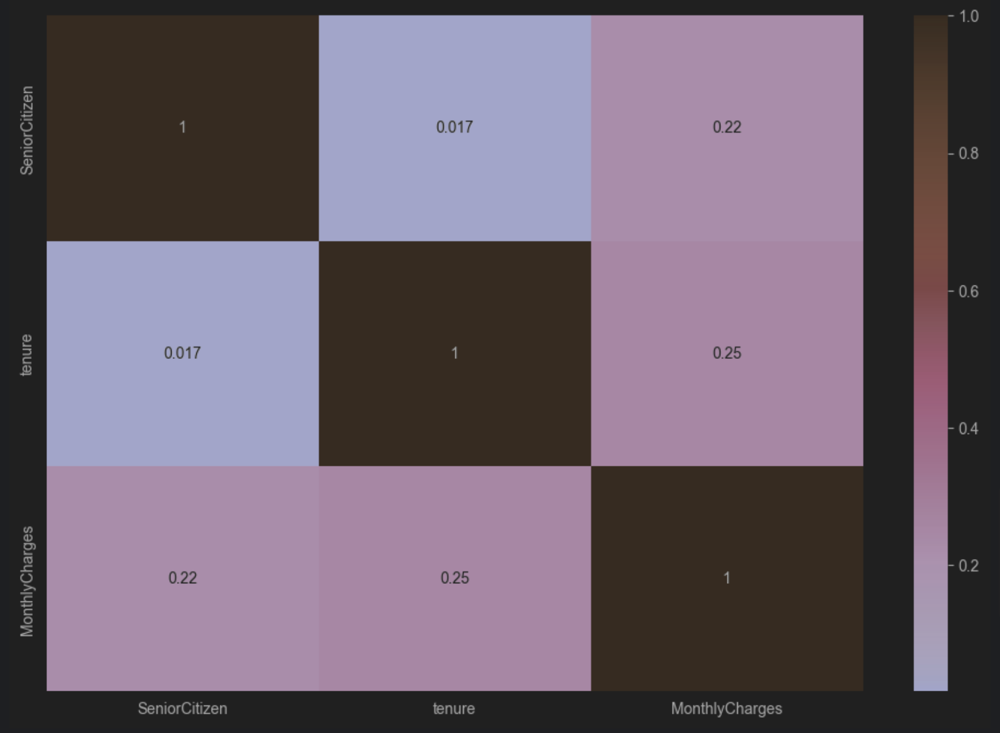
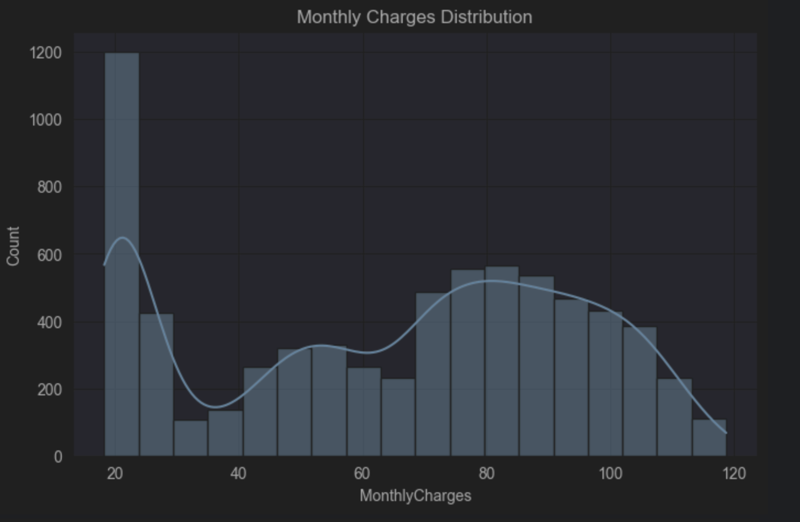
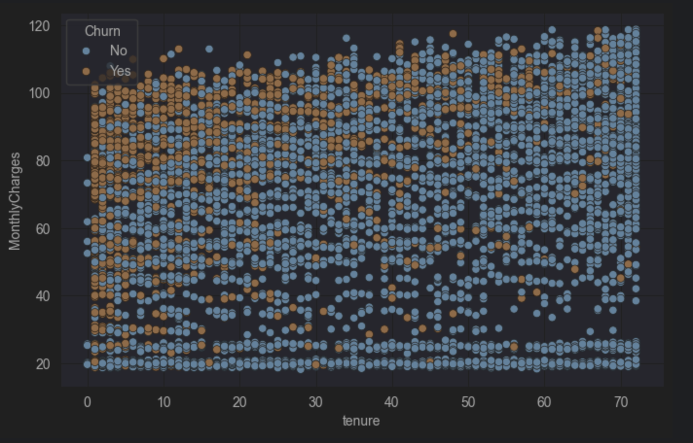
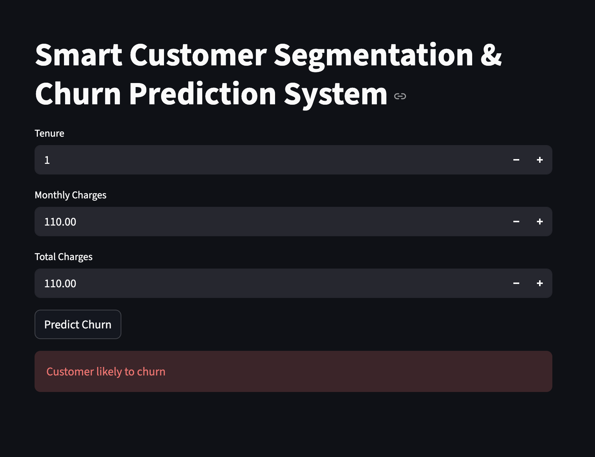
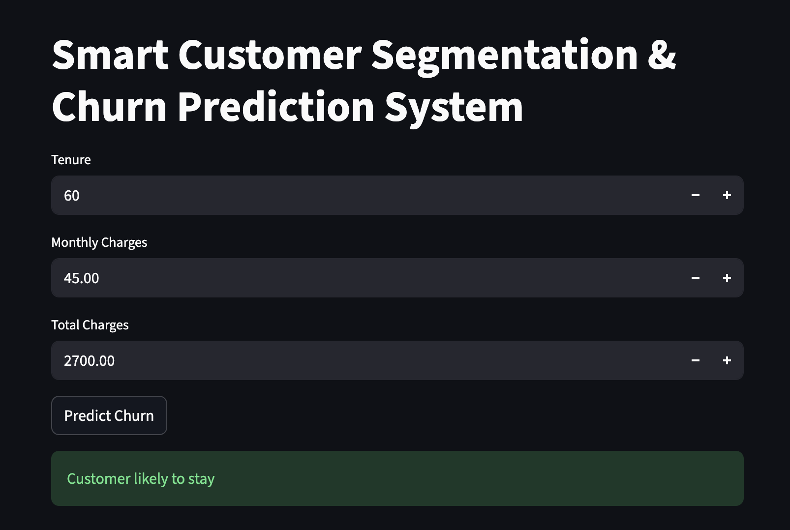
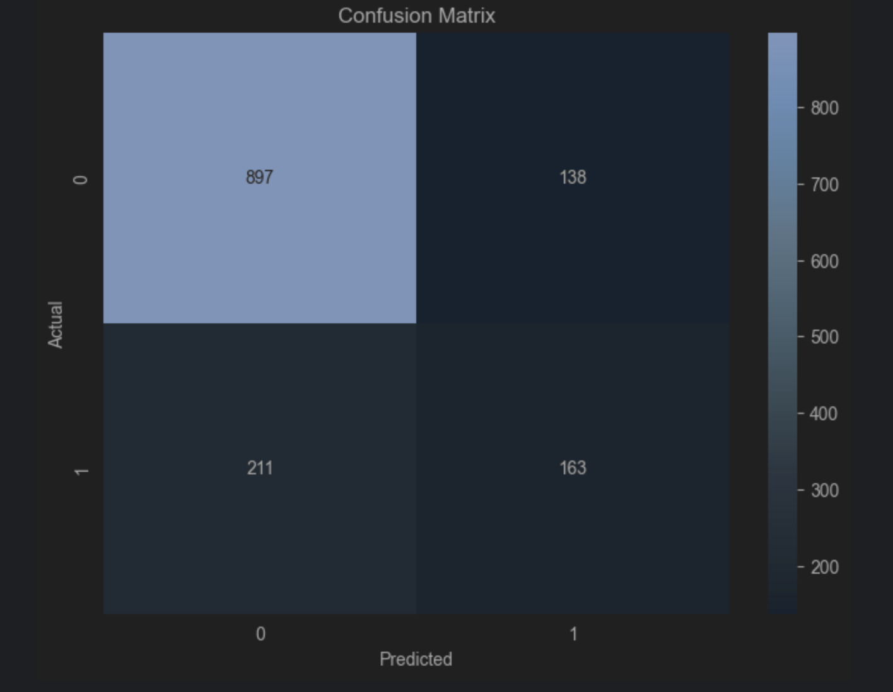
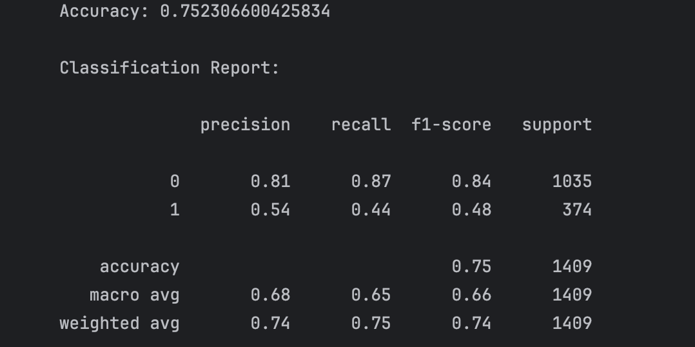

# Smart Customer Segmentation & Churn Prediction System

<p align="center">

</p>

<p align="center">
Machine Learning based customer churn analysis and prediction system for customer retention and business insights.
</p>

---

# Project Overview

This project focuses on analyzing customer behavior and predicting customer churn using Machine Learning techniques. The system performs customer segmentation, identifies customer patterns, visualizes business insights, and predicts whether a customer is likely to leave the service.

The main objective is to help businesses improve customer retention and make data-driven decisions.

---

# Features

✅ Customer Data Analysis  
✅ Exploratory Data Analysis (EDA)  
✅ Data Cleaning and Preprocessing  
✅ Customer Segmentation  
✅ Customer Churn Prediction  
✅ Data Visualization  
✅ Model Building  
✅ Model Evaluation  

---

# Dataset Information

**Dataset:** Telco Customer Churn Dataset

Source:  
https://www.kaggle.com/datasets/blastchar/telco-customer-churn

Dataset includes:

- Customer demographics
- Account details
- Monthly charges
- Total charges
- Services subscribed
- Contract details
- Churn status

Target Variable:

```text
Churn

Yes → Customer Leaves
No → Customer Stays
```

---

# Technologies Used

- Python
- Pandas
- NumPy
- Matplotlib
- Seaborn
- Scikit-Learn
- Streamlit
- Jupyter Notebook

---

# Project Workflow

### Step 1: Data Collection
- Loaded Telco Customer Churn Dataset

### Step 2: Data Cleaning
- Missing value handling
- Duplicate checking
- Data consistency checking

### Step 3: Exploratory Data Analysis
- Churn distribution analysis
- Correlation analysis
- Monthly charges analysis

### Step 4: Data Preprocessing
- Encoding
- Scaling
- Train-test split

### Step 5: Model Building
- Training machine learning model

### Step 6: Model Evaluation
- Confusion matrix
- Classification report
- Performance metrics

### Step 7: Prediction
- Predict whether customer churns or stays

---

## Workflow Diagram

<p align="center">
   
</p>

---

# Project Visualizations

## Customer Churn Distribution

<p align="center">

</p>

---

## Correlation Heatmap

<p align="center">

</p>

---

## Monthly Charges Analysis

<p align="center">

</p>

---

## Scatter Plot Analysis

<p align="center">

</p>

---

## Customer Churn Analysis

<p align="center">

</p>

---

## Customer Retention Analysis

<p align="center">

</p>

---

## Confusion Matrix

<p align="center">

</p>

---

## Classification Report

<p align="center">

</p>

---

# Results

Performance metrics:

- Accuracy
- Precision
- Recall
- F1 Score

---

# Future Improvements

- Hyperparameter tuning
- Cloud deployment
- Real-time analytics dashboard
- Multiple ML models

---

# Author

**Aditya Saurav**

Electronics & Communication Engineering (ECE)  
Machine Learning | Data Science | Competitive Programming
